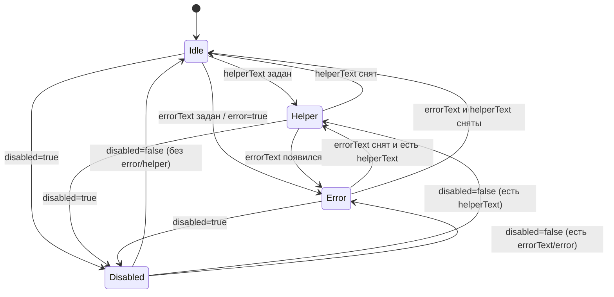

# Data Model: SelectField, ComboBoxField, TextAreaField

Все три компонента имеют **единую структуру** (paritet с `InputField`). Поэтому сущности описаны общо, а различия — в секции «Привязка к базовому компоненту».

---

## Сущность: `FieldWrapper` (общая структура)

Корень — `<div class="root">` с тремя дочерними узлами:

```text
<div class="root [rootDisabled]">
  <label class="label" htmlFor={controlId}>{label}</label>     ← опционально
  <div class="inputWrap">
    <{Базовый компонент} id={controlId} error aria-describedby ... />
  </div>
  <div class="helperSlot">
    {<p class="helperError" id={errorId} role="alert">errorText</p>}
    | {<p class="helper" id={helperId}>helperText</p>}
    | {<p class="helper helperInvisible" aria-hidden>&nbsp;</p>}
  </div>
</div>
```

### Поля сущности

| Поле | Тип | Описание |
|------|-----|----------|
| `label` | `string?` | Подпись над полем. Если пусто/undefined — `<label>` не рендерится |
| `helperText` | `string?` | Подсказка под полем. Скрывается при наличии `errorText` |
| `errorText` | `string?` | Текст ошибки. Приоритет над `helperText` |
| `disabled` | `boolean` | По умолчанию `false`. Подавляет визуал ошибки и `aria-invalid` |
| `error` | `boolean?` | Принудительный визуал ошибки даже без `errorText`. По умолчанию `undefined` |
| `id` | `string?` | Внешний id. Если задан — используется как id контрола (для `<label htmlFor>` и `aria-describedby` ссылок) |
| `className` | `string?` | Класс на корневой обёртке |
| `aria-describedby` | `string?` | Пользовательский описатель. Объединяется с auto-id helper/error через пробел |
| (остальные пропы) | — | Прозрачно пробрасываются в базовый компонент |

### Производные поля

| Поле | Формула |
|------|---------|
| `inputId` | `id ?? "turbo-{select|combobox|textarea}-field-{useId.replace(':','')}"` |
| `helperId` | `${inputId}-helper` |
| `errorId` | `${inputId}-error` |
| `hasErrorText` | `Boolean(errorText)` |
| `showError` | `Boolean(error || hasErrorText)` |
| `activeDescId` | `hasErrorText ? errorId : helperText ? helperId : undefined` |
| `ariaDescribedBy` | `[activeDescId, ariaDescribedByUser].filter(Boolean).join(' ') \|\| undefined` |

### Состояния и переходы



**Инварианты**:

1. Высота `helperSlot` ≥ `--typescale-caption-medium-height` всегда (даже в `Idle`).
2. В `Disabled` цвет label/helper/error — `--content-disabled`.
3. В `Error` (без disabled) цвет error-текста — `--content-error`.
4. В `Helper` (без disabled, без error) цвет — `--content-tertiary`.
5. Если `errorText` задан → `aria-invalid="true"` на контроле; если только `error=true` без текста → тоже `aria-invalid="true"`, но без `role="alert"`-элемента в DOM.

---

## Привязка к базовому компоненту

### `SelectField` → `Select`

| Элемент data-model | Куда отдаём в `Select` |
|--------------------|------------------------|
| `inputId` | `triggerId` (новый аддитивный проп; ставится на `<button>`) |
| `showError` | `error` |
| `disabled` | `disabled` |
| `ariaDescribedBy` | `aria-describedby` |
| остальные пропы (`options`, `value`, `onChange`, `size`, `placeholder`, …) | пробрасываются 1:1 |

`<label htmlFor={inputId}>` ссылается на `<button id={inputId}>`.

### `ComboBoxField` → `ComboBox`

| Элемент data-model | Куда отдаём в `ComboBox` |
|--------------------|--------------------------|
| `inputId` | `id` (ставится на `<input>` внутри) |
| `showError` | `error` |
| `disabled` | `disabled` |
| `ariaDescribedBy` | `aria-describedby` |
| остальные пропы (`options`, `value`, `onChange`, `size`, `multiline`, `mask`, …) | пробрасываются 1:1 |

`<label htmlFor={inputId}>` ссылается на `<input id={inputId}>`.

### `TextAreaField` → `TextArea`

| Элемент data-model | Куда отдаём в `TextArea` |
|--------------------|--------------------------|
| `inputId` | `id` (ставится на `<textarea>` внутри) |
| `showError` | `error` |
| `disabled` | `disabled` |
| `ariaDescribedBy` | `aria-describedby` |
| остальные пропы (`size`, `rows`, `leftIcon`, `endAdornment`, `borderless`, `width`, `maxWidth`, …) | пробрасываются 1:1 |

`<label htmlFor={inputId}>` ссылается на `<textarea id={inputId}>`.

В этой фиче `TextArea` теряет встроенные `helperText`/`errorText` и helper-слот. Обёртка `TextAreaField` строит helper сама — идентично `InputField`/`SelectField`/`ComboBoxField`.

---

## Сущность: `Label`

| Поле | Значение |
|------|---------|
| Тип элемента | `<label>` |
| Класс | `.label` |
| Типографика | `--typescale-lable-small-*` (font/size/weight/height/tracking) |
| Цвет (default) | `--content-primary` |
| Цвет (disabled) | `--content-disabled` |
| Однострочно | `overflow: hidden; text-overflow: ellipsis; white-space: nowrap` |
| Атрибуты | `htmlFor={inputId}` |

Если `label` пуст/undefined — элемент не рендерится. `<label>` НЕ оборачивает контрол (структура — flex-колонка).

---

## Сущность: `HelperSlot`

| Поле | Значение |
|------|---------|
| Тип элемента | `<div>` с фикс. min-height |
| Класс | `.helperSlot` |
| Min-height | `--typescale-caption-medium-height` |
| Содержимое (по приоритету) | error-текст → helper-текст → невидимый плейсхолдер |
| Типографика text | `--typescale-caption-medium-*` |
| Цвет error | `--content-error` |
| Цвет helper | `--content-tertiary` |
| Цвет (disabled) | `--content-disabled` |
| `role` error | `role="alert"` |
| Атрибуты | `id={errorId|helperId}`, `data-helper-tone={error|tertiary|disabled}`, `data-turbo-{entity}-field-helper` |

`helperInvisible` — `visibility: hidden`, содержит non-breaking space — резервирует высоту в режиме `Idle`.

---

## Сущность: изменения базовых компонентов

### `Select.triggerId?: string` (новый проп — аддитивно)

- **Тип**: `string | undefined`
- **Дефолт**: `undefined`
- **Поведение**: если задан — ставится атрибутом `id` на `<button>`-триггер `Select`. Не влияет на корневой `id` (если он задан отдельным пропом `id`).
- **Совместимость**: аддитивный, обратносовместимый.

### `TextArea`: удаление пропов `helperText` / `errorText` и встроенного helper-слота (breaking)

- Из публичного API `TextArea` **удаляются**: `helperText?: string`, `errorText?: string`.
- Из CSS-модуля `TextArea` **удаляются** правила: `.helperSlot`, `.helper`, `.helperError`, `.helperInvisible`, override `helperSlot > p { margin: 0 }`.
- Из JSX `TextArea` **удаляется**: блок `<div class="helperSlot">…</div>` (включая невидимый плейсхолдер высоты).
- Удаляется производный `helperId` / `errorId` и логика `activeDescId` / `ariaDescribedBy` склейки внутри `TextArea` — теперь `TextArea` использует `aria-describedby` пользователя как есть, без модификации (если задан).
- Остаются без изменений: `id` на `<textarea>`, `error`-проп (визуал рамки + `aria-invalid`), `disabled`, `size`, `rows`, `leftIcon`, `endAdornment`, `borderless`, `width`, `maxWidth` и т. п.
- **Совместимость**: breaking change. Внешние потребители мигрируют на `TextAreaField`.

---

## Validation rules (требования спецификации → код)

| Требование | Реализация |
|-----------|------------|
| FR-001 (label/helperText/errorText) | Пропы на каждом `*Field` |
| FR-002 (приоритет errorText > helperText) | `hasErrorText` ветка в renderer |
| FR-003 (`htmlFor` ↔ контрол) | `inputId` пробрасывается в `Select.triggerId`/`ComboBox.id`/`TextArea.id` |
| FR-004 (фикс высота helper) | `.helperSlot { min-height: var(--typescale-caption-medium-height) }` |
| FR-005 (aria-describedby) | склейка `[activeDescId, ariaDescribedByUser].filter(Boolean).join(' ')` |
| FR-006 (role="alert") | `<p role="alert">` в ветке errorText |
| FR-007 (disabled подавляет error) | `.rootDisabled` + `disabled` в контрол + цвет helper → `--content-disabled` |
| FR-008..FR-017 | Передача пропов 1:1 и опора на возможности базовых компонентов |
