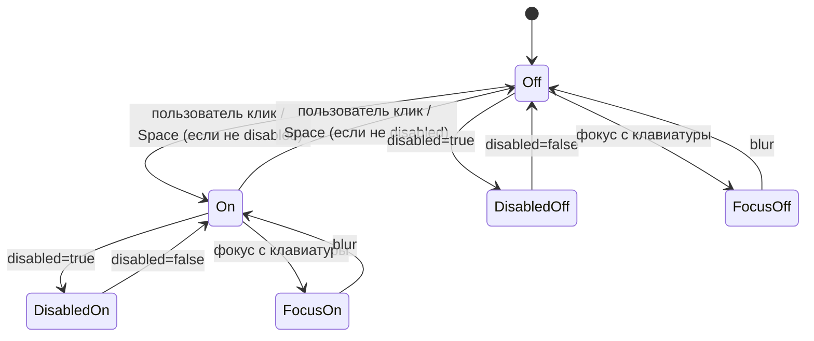

# Data Model: Toggle (switch)

`Toggle` — UI-компонент-переключатель. Нет персистентного хранилища: все «данные» — это props компонента и одно опциональное состояние uncontrolled-режима. Этот документ описывает поля сущности, производные значения, маппинг props → DOM, и state-машину.

---

## Сущность: `Toggle`

Корневой DOM-узел — `<label>`, ребёнок `<input type="checkbox" role="switch">`, далее — визуальные слоты:

```text
<label class="root sizeMedium [disabled]">
  [<span class="text textStart">{startText}</span>]   -- если задан
  <span class="control">
    <input type="checkbox" role="switch" class="native">
    <span class="track" aria-hidden>
      <span class="knob" />
    </span>
  </span>
  [<span class="text textEnd">{endText}</span>]       -- если задан
</label>
```

### Поля сущности (props)

| Поле | Тип | По умолч. | Описание |
|------|-----|-----------|----------|
| `size` | `'small' \| 'medium' \| 'large'` | `'medium'` | Размер трека/knob и типографика подписи. |
| `checked` | `boolean?` | — | Controlled-режим. Источник правды — проп. |
| `defaultChecked` | `boolean?` | `false` | Uncontrolled-режим. Начальное значение. |
| `disabled` | `boolean` | `false` | Блокирует переключение. |
| `onChange` | `(event: React.ChangeEvent<HTMLInputElement>) => void` | — | Хендлер смены значения. |
| `startText` | `ReactNode?` | — | Подпись слева от переключателя. |
| `endText` | `ReactNode?` | — | Подпись справа от переключателя. |
| `name` | `string?` | — | Native input attr — имя поля в форме. |
| `value` | `string?` | `'on'` | Native input attr — значение при `checked=true` в FormData. |
| `id` | `string?` | — | Native input attr. |
| `className` | `string?` | — | Класс на корневой `<label>`. |
| `style` | `CSSProperties?` | — | Inline-стили на корневой `<label>`. |
| `ref` | `Ref<HTMLInputElement>` | — | На нативный `<input>`. |
| (остальные `rest`) | `InputHTMLAttributes<HTMLInputElement>` | — | Пробрасываются на нативный `<input>`. |

### Производные значения

| Поле | Формула |
|------|---------|
| `isControlled` | `checked !== undefined` |
| `currentChecked` | `isControlled ? checked : uncontrolledState` |
| `trackColor` | `disabled ? --content-disabled : (currentChecked ? --content-primary : --content-tertiary)` |
| `knobColor` | `disabled ? --content-disabled : --surface-primary-main` |
| `textColor` | `disabled ? --content-disabled : --content-primary` |
| `knobTranslateX` | `currentChecked ? (track.width − knob.width − 2 × padding) : 0` (применяется через `transform: translateX(...)`) |
| `nativeDisabled` | `disabled` |
| `nativeChecked` | `isControlled ? checked : undefined` |
| `nativeDefaultChecked` | `!isControlled ? defaultChecked : undefined` |

### Состояния (visual state)



**Инварианты**:

1. В `Disabled*` ни клик мышью, ни Space не меняют значение.
2. `Focus*` — это надстройка над `Off`/`On` (focus-ring накладывается, цвет трека/knob не меняется).
3. Hover-состояние **отсутствует** — никаких визуальных изменений при наведении мыши.
4. Анимация перехода `Off ↔ On` — CSS transition (см. research.md §E); состояние «в процессе анимации» не моделируется в data-model — это деталь рендеринга.

### Геометрия по `size`

| `size` | `track.W × H` | `knob.size` | `padding` | `gap` (текст↔трек) | `border-radius` |
|--------|---------------|-------------|-----------|---------------------|-----------------|
| `small` | 24 × 16 | 12 × 12 | 2 px | `var(--spacing-8)` | track: 8 px (= h/2), knob: 50% |
| `medium` | 40 × 24 | 20 × 20 | 2 px | `var(--spacing-8)` | track: 12 px, knob: 50% |
| `large` | 44 × 28 | 24 × 24 | 2 px | `var(--spacing-12)` | track: 14 px, knob: 50% |

### Маппинг State → CSS class / атрибут

| Сигнал | Способ передачи в CSS |
|--------|------------------------|
| `size` | className `.sizeSmall` / `.sizeMedium` / `.sizeLarge` |
| `disabled` | className `.disabled` + native attr `disabled` |
| `currentChecked` | data-attr `data-checked=""` (или нативный `:checked` через `:has`) на `<label>` |
| `focus-visible` | `:has(.native:focus-visible)` на корне |

---

## Сущность: `ToggleSize`

```ts
export type ToggleSize = 'small' | 'medium' | 'large';
```

Используется в `size` пропе. Определяет:

- размер трека,
- размер knob,
- типографику подписи (`--typescale-lable-{small,medium,large}-*`),
- gap между подписью и треком.

---

## Сущность: `Track`

| Поле | Значение |
|------|----------|
| Тип элемента | `<span class="track" aria-hidden="true">` |
| `width` / `height` | по `size` (см. таблицу выше) |
| `background-color` | `trackColor` (производное от `disabled` + `currentChecked`) |
| `border-radius` | `track.height / 2` |
| `transition` | `background-color 0.15s ease` |
| `position` | `relative` (контейнер для knob) |

---

## Сущность: `Knob`

| Поле | Значение |
|------|----------|
| Тип элемента | `<span class="knob" />` |
| `width` / `height` | по `size` (см. таблицу выше) |
| `background-color` | `knobColor` |
| `border-radius` | `50%` |
| `position` | `absolute; top: padding; left: padding;` |
| `transform` | `translateX(knobTranslateX)` |
| `transition` | `transform 0.15s ease` |

---

## Сущность: `TextSlot`

| Поле | Значение |
|------|----------|
| Тип элемента | `<span class="text textStart|textEnd">` |
| Типографика | по `size` через токены `--typescale-lable-*` |
| Цвет | `textColor` |
| `overflow` / `text-overflow` | `hidden` / `ellipsis` (длинный текст обрезается) |
| `cursor` | `pointer` (наследует от label); в `disabled` — `not-allowed` |

Слот рендерится только при заданном пропе (`startText` / `endText`).

---

## Validation rules (требования спецификации → код)

| Требование | Реализация |
|------------|------------|
| FR-001 (нативный `<input type="checkbox" role="switch">`) | `<input>` в JSX с `type="checkbox"` и `role="switch"`. |
| FR-002 (controlled/uncontrolled) | `isControlled = checked !== undefined`; uncontrolled — `useState(defaultChecked)`. |
| FR-003 (размеры) | className `.sizeSmall/.sizeMedium/.sizeLarge` + CSS. |
| FR-004 (типографика подписи по `size`) | className `.textSmall/.textMedium/.textLarge` (или общий класс `.text` + override через `.sizeX .text`). |
| FR-005 (startText/endText) | условный рендер `{startText && <span class="text textStart">…</span>}`. |
| FR-006 (клик по подписи) | `<span class="text">` — потомок `<label>` с вложенным `<input>`; нативное поведение. |
| FR-007 (disabled) | native `disabled` + класс `.disabled`. |
| FR-008 (цвета off/on/disabled, без hover) | CSS-правила без `:hover` для трека/knob. |
| FR-009 (focus-ring) | `:has(.native:focus-visible)` + outline. |
| FR-010 (только токены + ONY One) | все цвета — `var(--content-*)/--surface-*`; шрифт — `var(--family-brand)`. |
| FR-011 (native attrs пробрасываются) | `...rest` на `<input>`. |
| FR-012 (ref на input) | `React.forwardRef<HTMLInputElement, ToggleProps>`. |
| FR-013 (className/style) | через `clsx` на `<label>`. |
| FR-014 (анимация) | `transition: 0.15s ease`. |
| FR-015 (turbo-ui + turbo-ui/toggle) | `src/index.ts`, `package.json` exports, `vite.config.lib.js` entry. |
| FR-016 (Storybook + Docs) | `Toggle.stories.tsx`, `Toggle.docs.tsx`. |
| FR-017 (storySort.order) | `.storybook/preview.js`. |
